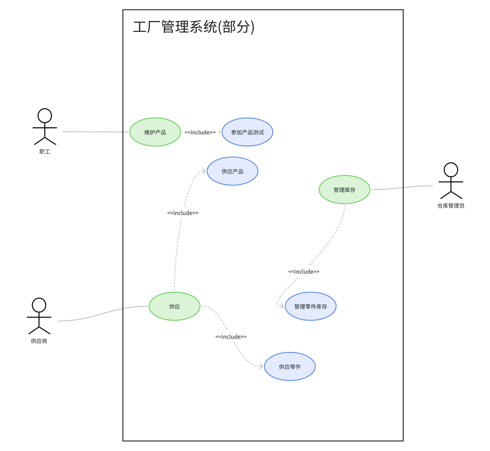
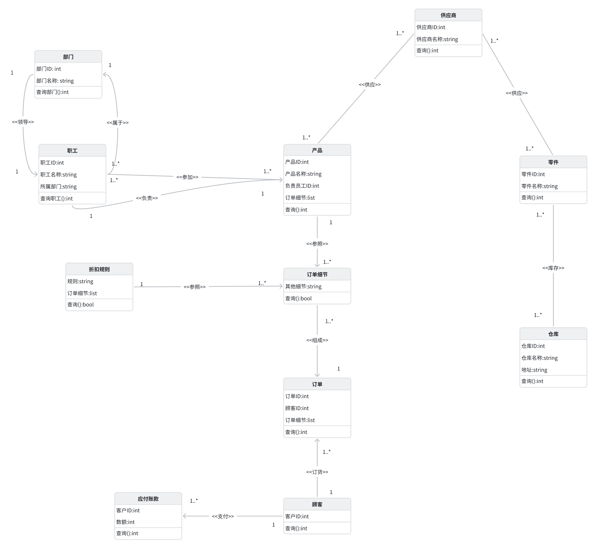
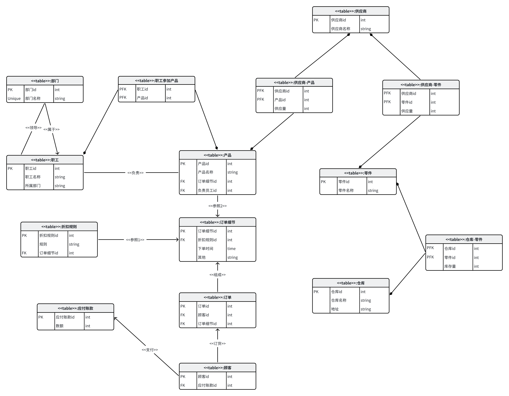
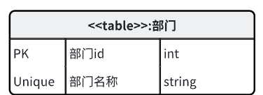
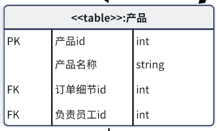
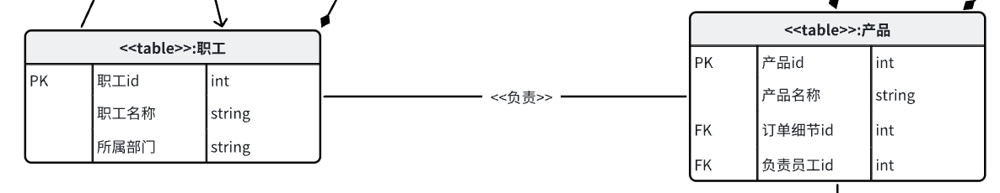
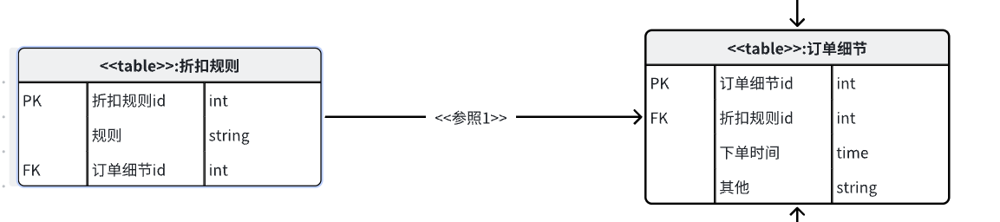
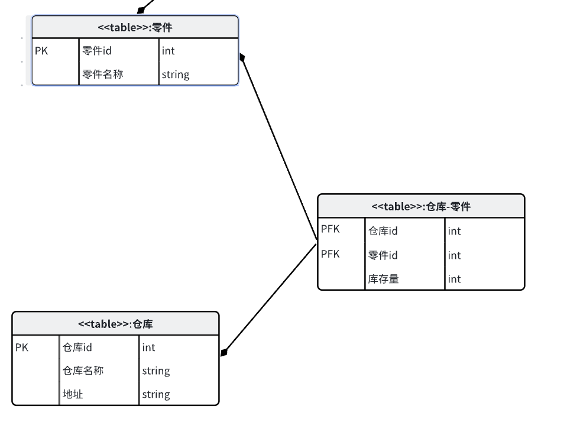

# UML数据库设计方法

## 一、引言

UML（统一建模语言，Unified Modeling Language）是一种用于软件工程的标准化建模语言，旨在帮助开发者可视化、描述、构建和记录软件系统的设计。UML也同样可以用于数据库的设计。传统的关系数据库设计过程可分为四个阶段：需求分析、概念结构设计、逻辑结构设计、物理结构设计。基于UML的关系数据库设计也可以分为四个阶段：业务Use Case模型设计、逻辑数据模型设计、物理数据模型设计、物理实现设计，我们将按照这个顺序介绍基于UML的数据库设计，包含UML用于数据库设计的规范和UML方法与传统方法的对比。

## 二、业务use case模型设计

UML方法的use case模型设计对应于传统方法的需求分析和概念设计。传统方法的需求分析是通过调查现实世界要处理的对象明确需求，定义数据库功能。传统方法的概念结构设计是将需求分析得到的用户需求抽象为信息结构，主要以E-R图的形式展现E-R模型。UML方法使用use case模型分析需求，使用类图描述概念模型。

以某工厂管理信息系统为例

传统方式经过需求分析得到该系统的实体，实体之间关系和数据字典

构建的E-R图简单表示为：

结合uml方法使用use case模型将分散的需求构建成用例模型，能更简单的整合分析需求，便于后续设计实体，数据项。

比如像管理员通过系统管理零件库存、供应商通过系统进行相关的供应设置等分散的应用需求可以通过用例图构建一个综合的场景。

use case(部分)：

构建的概念模型用类图简单表示为：

## 三、逻辑数据模型设计

UML方法的逻辑数据模型设计对应传统方法的逻辑结构设计，都是将前面设计好的模型转换为与所使用数据模型符合的逻辑结构。在这一阶段，主要任务是确定应用系统所需长期保存的实体数据，用类图等建立数据库的逻辑模型。对于关系数据库，则需要根据系统中的实体类，创建关系数据库模式，包括表、视图、索引等数据结构元素的设计，以及相应的触发器、存储器的设计。

对于本例，由概念模型产生的逻辑模型为：

（UML进行数据库设计规范）

*表*：在使用UML进行数据库设计的时候，表 用类的图标表示，用“《table》”标明表类，类名即表名，类的属性描述表的列特性，包括列名、数据类型，以及有关的约束。在类的行为部分，根据需要可以给出对表的一些操作的描述，也可以缺省。

*约束*：约束是一种施加于数据库结构的规则，用于保证数据库的正确性或完整性。

1. 主关键字约束：加在表的图标中的一个属性名前面，表示该属性为主关键字，也可以加在一个操作名前表示该操作的类型。主关键字约束使用构造型“PK”表示，也可用一个小图标“PK”代替。

2. 外来关键字约束：加在表中的一个属性名前面，表示该属性为外来关键字，也可以加在一个操作名前表示该操作的类型。外来关键字约束使用构造型“FK”表示，也可用一个小图标“FK”代替。

3. 值唯一性约束：保证所定义列的所有值是互不相同的。值唯一性约束使用构造型“Unique”表示，它可以加在一个操作名前面，以表示该操作是一个值检验约束。

*关联*：

1. 一对一

2. 一对多

3. 多对多

## 四、物理数据模型设计

传统：直接设计

使用组件图、配置图创建表空间

## 五、物理实现设计

